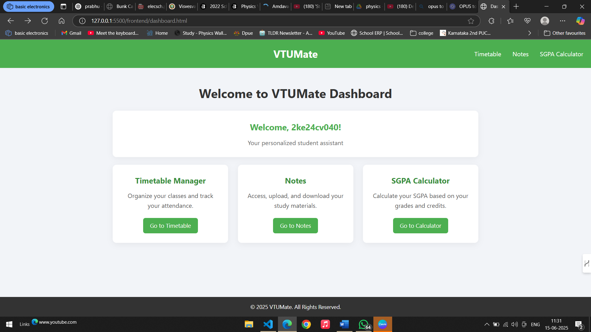
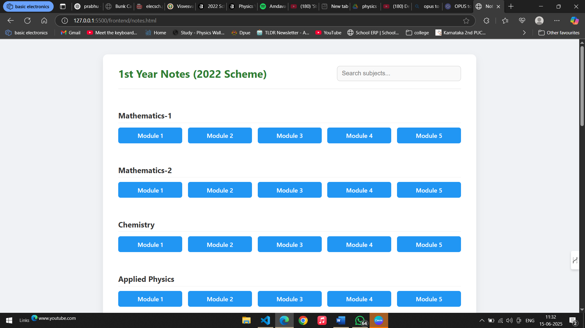
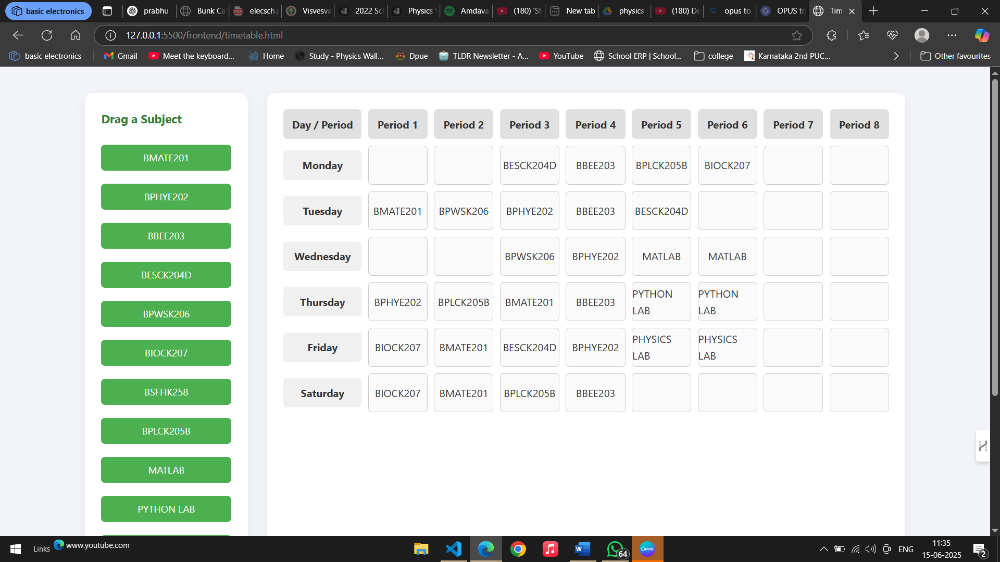
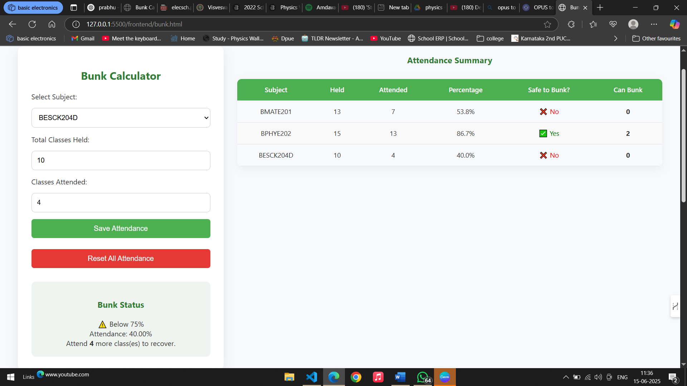
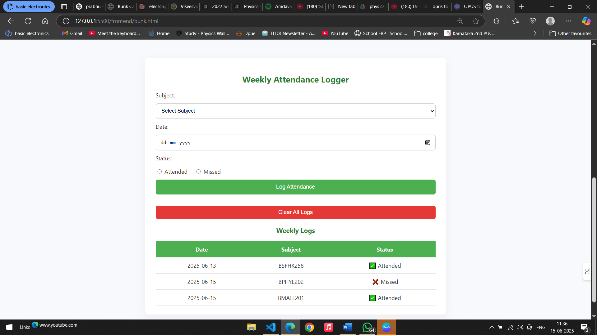
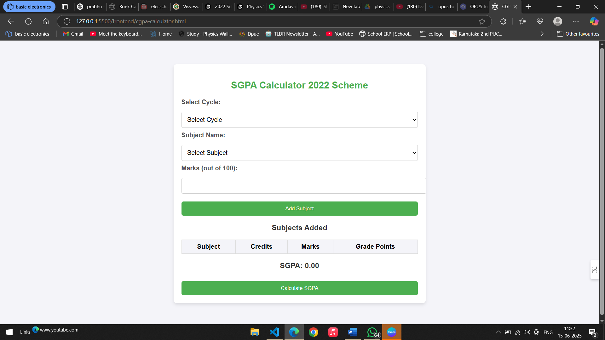

# VTUMate - Student Management System

A comprehensive web-based student management application designed for VTU (Visvesvaraya Technological University) students to streamline their academic life.

## 🌟 Features

- **User Authentication**: Secure login and registration system
- **Dashboard**: Centralized hub for all student activities
- **Timetable Manager**: Organize classes and track attendance
- **Notes Management**: access and download study materials
- **SGPA Calculator**: Calculate Semester Grade Point Average based on grades and credits
- **Class Bunking Tracker**: Monitor attendance patterns


## 📸 Screenshots








## 🛠️ Technologies Used

### Frontend
- **HTML5**: Structure and markup
- **CSS3**: Styling and responsive design
- **JavaScript**: Interactive functionality and DOM manipulation

### Backend
- **JSON Database**: Simple data storage for user management

## 📁 Project Structure

```
vtumate/
├── frontend/
│   ├── index.html          # Landing page
│   ├── login.html          # Login page
│   ├── register.html       # Registration page
│   ├── dashboard.html      # Main dashboard
│   ├── timetable.html      # Timetable management
│   ├── notes.html          # Notes management
│   ├── cgpa-calculator.html # SGPA calculator
│   ├── bunk.html           # Attendance tracker
│   └── css/js files        # Styling and functionality
└── backend/
    └── db.json             # User data storage
```

## 🚀 Getting Started

### Prerequisites
- A modern web browser
- Local web server (optional, for backend functionality)

### Installation

1. **Clone the repository**
   ```bash
   git clone https://github.com/yourusername/vtumate.git
   cd vtumate
   ```

2. **Open in browser**
   - Open `frontend/index.html` in your preferred web browser
   - Or serve the files using a local server for full functionality

3. **For local development with backend**
   ```bash
   # If using json-server for the backend
   npx json-server --watch backend/db.json --port 3001
   ```

## 💡 How to Use

1. **Registration**: Create a new account with your USN and password
2. **Login**: Access your dashboard with your credentials
3. **Dashboard**: Navigate to different features from the main dashboard
4. **Timetable**: Add and manage your class schedule
5. **Notes**: Upload and organize your study materials
6. **SGPA Calculator**: Input your grades and credits to calculate SGPA
7. **Attendance Tracker**: Monitor your class attendance

## 🎨 Features Overview

### User Authentication
- Secure login system with USN-based identification
- User registration with academic details
- Session management using localStorage

### Dashboard
- Clean, intuitive interface
- Quick access to all features
- Personalized welcome message

### Timetable Manager
- Weekly schedule view
- Add/edit class timings
- Subject and classroom details

### Notes Management
- File upload functionality
- Organized by subjects
- Download capabilities

### SGPA Calculator
- Grade point calculation
- Credit-based weighting
- Semester-wise results

## 🔧 Customization

The application can be easily customized:

- **Styling**: Modify CSS files in the frontend directory
- **Features**: Add new pages and functionality
- **Data Structure**: Extend the JSON database schema
- **University-specific**: Adapt for other university systems

## 📱 Responsive Design

VTUMate is designed to work seamlessly across different devices:
- Desktop computers
- Tablets
- Mobile phones

## 🤝 Contributing

Contributions are welcome! Please feel free to submit a Pull Request.

1. Fork the project
2. Create your feature branch (`git checkout -b feature/AmazingFeature`)
3. Commit your changes (`git commit -m 'Add some AmazingFeature'`)
4. Push to the branch (`git push origin feature/AmazingFeature`)
5. Open a Pull Request

## 📝 License

This project is licensed under the MIT License - see the [LICENSE](LICENSE) file for details.

## 👤 Author

**Your Name**
- GitHub: [@nijagowda](https://github.com/nijagowda)
- LinkedIn: [Nijagowda Patil](https://www.linkedin.com/in/nijagowdapatil)

## 🙏 Acknowledgments

- VTU for the academic structure reference
- All contributors who helped improve this project
- The open-source community for inspiration

## 🔮 Future Enhancements

- [ ] Real-time notifications
- [ ] Mobile app version
- [ ] Advanced analytics dashboard
- [ ] Integration with university APIs
- [ ] Multi-semester tracking
- [ ] Assignment deadline reminders
- [ ] Study group features

---

⭐ **If you found this project helpful, please give it a star!** ⭐
